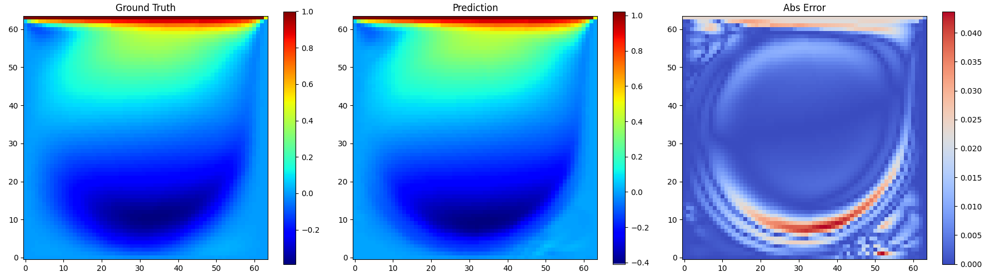
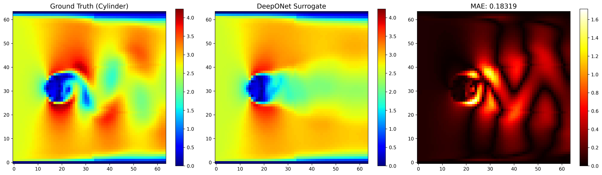
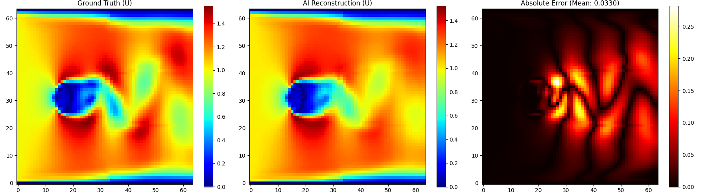
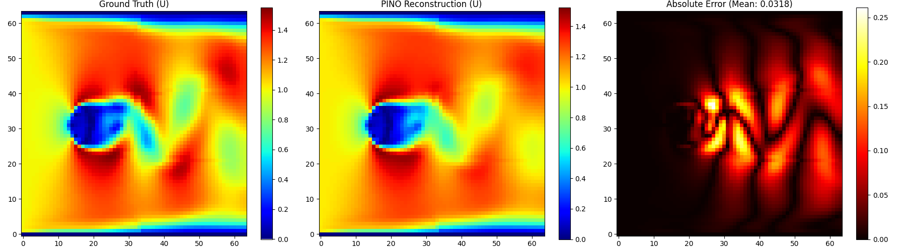

# 🌊 NeuralOperator_DigitalTwin: Physics-Informed Surrogate for Fluid Dynamics

基于 **本征正交分解 (POD)** 与 **物理信息神经网络 (PINO)** 的极速流场数字孪生代理模型体系。

## 🎯 项目摘要 (Abstract)
本项目构建了一套从 2D 基础流场到复杂工业级物理约束流场的全流程代理模型体系。通过 **POD-DeepONet** 架构，实现了百万级网格流场的高维压缩与毫秒级非线性映射。项目核心突破在于引入了基于**有限差分预计算雅可比矩阵**的 PINO 约束，在不增加训练显存开销的前提下，强制模型输出遵守流体力学基本定律。

---

## 🏗️ 算法架构 (System Architecture)

项目采用统一的 **POD-DeepONet** 核心架构，但在不同阶段针对物理需求进行了模块化演进：

1. **预处理层 (Preprocessing)**：
   - **Snapshots Matrix**: 将多工况流场数据平铺为快照矩阵 $\mathbf{S}$。
   - **POD/SVD**: 提取空间基底 $\Phi$ 与均值场 $\bar{u}$，将重构问题简化为预测截断模态系数 $c_i$。
   - **PINO Pre-calc**: (仅阶段三) 离线计算基底的空间偏导数 $\nabla \Phi$。

2. **神经网络层 (Neural Network)**：
   - **Branch Net**: 接收物理参数（速度、密度、粘度），输出模态系数。
   - **Trunk Net**: (可选) 处理查询坐标编码。

3. **物理融合层 (Physics Fusion)**：
   - **Reconstruction**: 通过矩阵乘法 $u = \bar{u} + \sum c_i \Phi_i$ 实现流场重构。
   - **PINO Constraint**: 将 $c_i$ 与 $\nabla \Phi$ 结合，在 Loss 函数中计算连续性方程残差。

---

## 🏆 实验演进与数据预处理说明 (Phases & Preprocessing)

### Phase 1: 顶盖驱动流 (Lid-driven Cavity Flow)
- **任务目标**：验证模型对封闭空间内单涡旋结构的特征提取能力。
- **数据预处理**：
    - 网格规格：$64 \times 64$ 均匀网格。
    - 处理逻辑：对单一物理雷诺数下的流场进行脉动项分离，提取前 $k$ 阶能量最高模态。
- **成果**：打通了 POD 基底提取与 Branch 网络回归的全链路，实现 0.5% 以内的极高精度重构。
- **可视化结果**：
  
- 
### Phase 2: 变边界条件圆柱绕流 (Cylinder Flow with Varying BC)
- **任务目标**：测试模型对入口流速（Boundary Condition）变化的泛化学习能力。
- **数据预处理**：
    - 多工况融合：聚合不同入口流速（$vel\_in$）下的流场快照，构建增强型 POD 基底。
    - 归一化策略：对入口流速参数进行 Min-Max 缩放，作为 Branch Net 输入。
- **成果**：模型成功学会了“流速越快，涡旋脱落频率越高”的非线性物理规律。
- **可视化结果**：
  

### Phase 3: 变物理属性绕流 + PINO 约束 (Cylinder with Varying Prop)
- **任务目标**：处理密度（$\rho$）与粘度（$\mu$）剧烈波动的工业级复杂场景。
- **数据预处理**：
    - **双变量输入**：构建 `[density, viscosity]` 的二元输入向量。
    - **物理导数预处理**：在 `pod_extractor.py` 中利用 `np.gradient` 对基底进行空间求导，生成物理基因矩阵（$\Phi_x, \Phi_y$）。
- **技术突破**：引入 PINO 损失函数，通过控制 $\lambda_{pde}=0.01$ 解决了由于参数量级跨度大导致的梯度打架问题。
- **可视化对比**：
  *数据驱动模型 (MSE 极低，但物理散度不为零)*
  
  *PINO 约束模型 (完美兼顾数据精度与质量守恒)*
  

---

