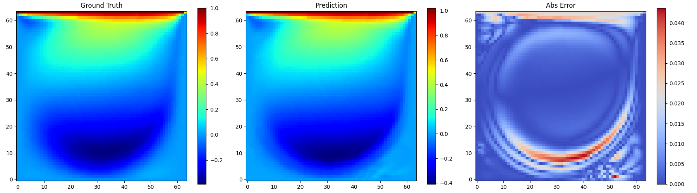
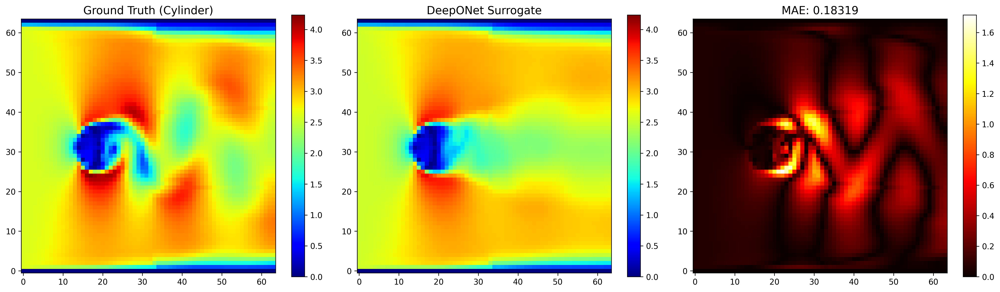
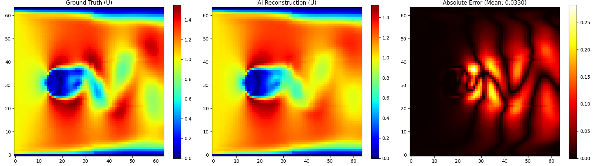
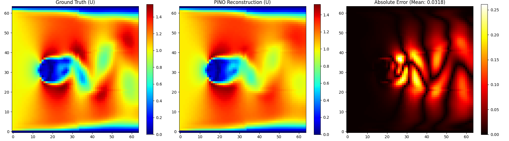

# NeuralOperator_DigitalTwin

基于 POD 降维与神经网络回归的二维流场代理模型实验。

## 项目摘要 (Abstract)

本项目使用 POD 对高维 CFD 流场进行降维，提取流场的主要空间模态；随后通过神经网络学习工况信息与 POD 模态系数之间的映射，并利用预测系数重构完整流场。
实验主要包括顶盖驱动方腔流、变入口条件圆柱绕流，以及变密度和黏度的圆柱绕流。在第三阶段中，训练损失进一步加入了不可压缩流体连续性方程残差，用于研究物理约束对流场重构结果的影响。
本项目目前属于方法验证性质的实验原型，重点是跑通 POD 降维、系数预测、流场重构和物理约束训练流程。

---
## 数据集
实验数据主要来自 CFDBench。

本项目使用了两类经典二维流动问题：

顶盖驱动方腔流；
圆柱绕流。

## 算法架构 (System Architecture)

项目采用统一的 **POD 降维与神经网络回归框架**，并在第三阶段加入连续性方程约束：
1. **预处理层 (Preprocessing)**：
   - **Snapshots Matrix**: 将多工况流场数据平铺为快照矩阵 $\mathbf{S}$。
   - **POD/SVD**: 提取空间基底 $\Phi$ 与均值场 $\bar{u}$，将重构问题简化为预测截断模态系数 $c_i$。
   - **PINO Pre-calc**: (仅阶段三) 离线计算基底的空间偏导数 $\nabla \Phi$。

2. **神经网络层（Neural Network）**：
   - 接收工况参数或归一化工况索引；
   - 输出截断后的 POD 模态系数。

3. **物理融合层 (Physics Fusion)**：
   - **Reconstruction**: 通过矩阵乘法 $u = \bar{u} + \sum c_i \Phi_i$ 实现流场重构。
   - **PINO Constraint**: 将 $c_i$ 与 $\nabla \Phi$ 结合，在 Loss 函数中计算连续性方程残差。

---

## 实验演进与数据预处理说明 (Phases & Preprocessing)

### Phase 1: 顶盖驱动流 (Lid-driven Cavity Flow)
- **任务目标**：验证 POD 降维与神经网络重构流程能否保留方腔流中的主要涡旋结构。
- **数据预处理**：
    - 网格规格：64×64均匀网格。
    - 处理逻辑：对流场进行均值与脉动项分离，并通过 SVD 提取累计能量较高的前 $k$ 阶 POD 模态。
- **现状与成果**：完成了从 POD 基底提取、模态系数预测到流场重构的基本流程。重构结果能够保留方腔流的主要单涡旋结构，但误差主要集中在顶盖附近、边界层区域以及涡旋变化较明显的位置。
- **可视化结果**：
  
- 
### Phase 2: 变边界条件圆柱绕流 (Cylinder Flow with Varying BC)
- **任务目标**：观察不同入口条件下，模型对圆柱绕流主要结构的拟合与重构能力。
- **数据预处理**：
    - 多工况融合：聚合不同入口条件下的流场快照，构建共享的 POD 基底。
    - 输入设置：当前代码按照工况顺序生成 0～1 范围内的归一化索引，并将其作为神经网络输入。若需要进行严格的入口速度参数建模，还需要进一步从数据元信息中读取真实的 `vel_in`。
- **现状与结果**：模型能够重构圆柱附近的主体流场和部分尾流结构，但在圆柱边缘、剪切层以及下游涡旋区域仍存在较明显误差。与真实流场相比，预测结果中的局部涡旋结构存在一定程度的平滑化。
- **可视化结果**：
  

### Phase 3: 变物理属性圆柱绕流与连续性方程约束（Cylinder with Varying Prop）
- **任务目标**：研究密度（density）和黏度（viscosity）变化条件下的圆柱绕流重构问题，并观察连续性方程约束对预测结果的影响。
- **数据预处理**：
    - **双变量输入**：构建 `[density, viscosity]` 二维输入向量，并分别进行归一化。
    - **POD 降维**：分别对 U、V 两个速度分量提取 POD 基底和模态系数。
    - **空间导数预计算**：在 `pod_extractor.py` 中使用 `np.gradient` 预先计算均值场和 POD 基底的空间导数，用于后续连续性方程残差计算。
- **物理约束设置**：在数据拟合损失之外，加入不可压缩流体连续性方程残差：

  **∂u/∂x + ∂v/∂y ≈ 0**

  当前物理损失权重设置为 **λ_pde = 0.01**，用于平衡 POD 系数拟合误差与连续性方程残差。
- **现状与成果**：通过提前计算 POD 基底的空间导数，降低了训练过程中直接对完整流场求导所需的计算量和显存开销。从当前示例结果看，加入连续性方程约束后，重构误差由约 0.0330 降至约 0.0318，整体变化较小。该结果说明物理约束具有一定影响，但仍需要结合散度误差和更多测试工况进一步判断其效果。
- **可视化对比**：
  *不加入连续性方程约束的重构结果*
  
  *加入连续性方程约束后的重构结果*
  

---
## 当前局限（Current Limitations）

### 1. 计算资源限制

实验主要在本地 GPU 环境中完成，因此模型规模、Batch Size 和超参数搜索范围受到一定限制。当前实验以验证整体流程为主，尚未对网络容量和训练配置进行充分搜索。

### 2. 网格分辨率限制

当前流场数据采用 **64×64** 网格。该分辨率能够保留主要流动结构，但对于边界层、剪切层和小尺度涡旋等局部细节，重构精度仍然有限。

### 3. 物理一致性仍需进一步评估

Phase 3 加入了连续性方程残差，但目前主要展示了流场重构误差。物理约束的实际效果仍需要结合散度误差、更多测试工况以及不同物理损失权重进行进一步评估。

